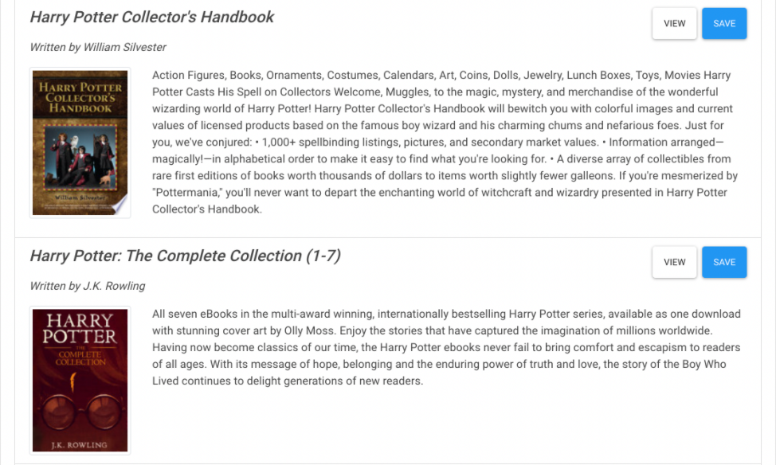

# google-booksearch

## Description
Google-book-search is a React based app. Users will be able to search for books and will display after users search. The book database will be built with MongoDB and includes book title, authors, description, image, and link. 

## User Story
A user wants to be able to search for books and is looking for more information. The desired book will display after user input along with an image, author and more info that will be useful to the reader.

## Acceptance Criteria
- Given when opening app and search page is displayed
- Given when searching for book and book info is displayed
- Given when book infor includes title, authors, description, image and link

## Tools and Technologies
- React
- Node
- Express
- MongoDB
- React-DOM
- Mongoose

## Usage 
> **To view this application**: visit deployed [Link](https://gentle-gorge-94839.herokuapp.com/)

## Mock Up

